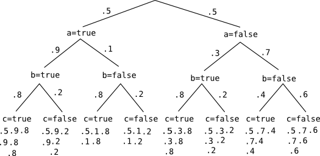

* table of contents
{:toc}

# Program

## Prior (without factor statement)

~~~
var flip = function(p) {
  if (p) {
    return sample(bernoulliERP, [p]);
  } else {
    return sample(bernoulliERP, [0.5]);
  }
}
var abc = function() {
  var a = flip();
  var b = flip(a? 0.9 : 0.3);
  var c = flip(a|b? 0.8 : 0.4);
  return(a+b+c);
}

var priorERP = Enumerate(abc, 20);
print(priorERP);
~~~

## Posterior (with factor statement `F`)

~~~
///fold:
var flip = function(p) {
  if (p) {
    return sample(bernoulliERP, [p]);
  } else {
    return sample(bernoulliERP, [0.5]);
  }
}
///
var abc = function() {
  var a = flip();
  var b = flip( a ? 0.9 : 0.3);
  var c = flip( (a|b) ? 0.8 : 0.4);
  var F = a+b+c == 2 ? 2 : 0;
  factor(F);
  return(a+b+c);
}

var trueERP = Enumerate(abc, 20);
print(trueERP);
~~~

## Particle Filtering

~~~
///fold:
var flip = function(p) {
  if (p) {
    return sample(bernoulliERP, [p]);
  } else {
    return sample(bernoulliERP, [0.5]);
  }
}
var abc = function() {
  var a = flip();
  var b = flip( a ? 0.9 : 0.3);
  var c = flip( (a|b) ? 0.8 : 0.4);
  var F = a+b+c == 2 ? 2 : 0;
  factor(F);
  return(a+b+c);
}
var trueERP = Enumerate(abc, 20);
///

var total_variation_distance = function(ERP) {
  var sample_support = ERP.support();
  var true_support = trueERP.support();
  var true_probs = map(function(x) {
    return Math.exp(trueERP.score([], x));
  }, sample_support);
  var sample_probs = map(function(x) {
    return Math.exp(ERP.score([], x));
  }, sample_support);
  return 0.5 * sum(map2(function(true_prob, sample_prob) {
    return Math.abs(sample_prob - true_prob);
  }, true_probs, sample_probs));
}

var check_particle_filter = function(n_particles) {
  return function() {
    var sampleERP = ParticleFilter(abc, n_particles);
    return total_variation_distance(sampleERP);
  }
}

var n_samples = 100;

bar(
  [3, 5, 10, 20, 100], 
  map(function(n_particles) {
    return expectation(ParticleFilter(check_particle_filter(n_particles), n_samples));
  }, [3, 5, 10, 20, 100])
)
~~~

# Calculating heuristic factors

* Expected score

$$ \begin{align*}
	\mathbb{E}(score \ | \ a=true)
		&= \sum_{b, c} P(b)P(c)(\ln(P(a=true)P(b)P(c)) + F(a=true,b,c)) \\
		&= (.9)(0.8)(\ln((0.5)(.9)(0.8)) + 0) +
		   (.9)(0.2)(\ln((0.5)(.9)(0.2)) + 2) + \\
		   & \ \ \ \ \ \ \ \ \ \ \ (0.1)(0.8)(\ln((0.5)(0.1)(0.8)) + 2) +
		   (0.1)(0.2)(\ln((0.5)(0.1)(0.2)) + 0) \\
	& \approx -0.99863 \\
	\mathbb{E}(score \ | \ a=false)
		&= \sum_{b, c} P(b)P(c)(\ln(P(a=false)P(b)P(c)) + F(a=false,b,c)) \\
		&= (0.3)(0.8)(\ln((0.5)(0.3)(0.8)) + 2) +
		   (0.3)(0.2)(\ln((0.5)(0.3)(0.2)) + 0) +\\
		   & \ \ \ \ \ \ \ \ \ \ \ (0.7)(0.4)(\ln((0.5)(0.7)(0.4)) + 0) +
		   (0.7)(0.6)(\ln((0.5)(0.7)(0.6)) + 0) \\
	& \approx -1.4452 \\
	\mathbb{E}(score \ | \ a=true, b=true)
		&= \sum_{c} P(c)(\ln(P(a=true)P(b=true)P(c)) + F(a=true,b=true,c)) \\
		&= (0.8)(\ln((0.5)(0.9)(0.8))) + (0.2)(\ln((0.5)(0.9)(0.2)) + 2) \\
	& \approx -0.89891 \\
	\mathbb{E}(score \ | \ a=true, b=false)
		&= \sum_{c} P(c)(\ln(P(a=true)P(b=false)P(c)) + F(a=true,b=false,c)) \\
		&= (0.8)(\ln((0.5)(0.1)(0.8)) + 2) + (0.2)(\ln((0.5)(0.1)(0.2)) + 0) \\
	& \approx -1.8961 \\
	\mathbb{E}(score \ | \ a=false, b=true)
		&= \sum_{c} P(c)(\ln(P(a=false)P(b=true)P(c)) + F(a=false,b=true,c)) \\
		&= (0.8)(\ln((0.5)(0.3)(0.8)) + 2) + (0.2)(\ln((0.5)(0.3)(0.2)) + 0) \\
	& \approx -0.79752 \\
	\mathbb{E}(score \ | \ a=false, b=false)
		&= \sum_{c} P(c)(\ln(P(a=false)P(b=false)P(c)) + F(a=false,b=false,c)) \\
		&= (0.4)(\ln((0.5)(0.7)(0.4)) + 0) + (0.6)(\ln((0.5)(0.7)(0.6)) + 0) \\
	& \approx -1.7228
\end{align*} $$

* Expected future score

$$ \begin{align*}
	\mathbb{E}(future \ score \ | \ a=true)
		&= \sum_{b, c} P(b)P(c)(\ln(P(b)P(c)) + F(a=true,b,c)) \\
		&= (.9)(0.8)(\ln((.9)(0.8)) + 0) +
		   (.9)(0.2)(\ln((.9)(0.2)) + 2) + \\
		& \ \ \ \ \ \ \ \ \ \ \ (0.1)(0.8)(\ln((0.1)(0.8)) + 2) +
		   (0.1)(0.2)(\ln((0.1)(0.2)) + 0) \\
		& \approx -0.30549 \\
	\mathbb{E}(future \ score \ | \ a=false)
		&= \sum_{b, c} P(b)P(c)(\ln(P(b)P(c)) + F(a=false,b,c)) \\
		&= (0.3)(0.8)(\ln((0.3)(0.8)) + 2) +
		   (0.3)(0.2)(\ln((0.3)(0.2)) + 0) +\\
		& \ \ \ \ \ \ \ \ \ \ \ (0.7)(0.4)(\ln((0.7)(0.4)) + 0) +
		   (0.7)(0.6)(\ln((0.7)(0.6)) + 0) \\
		& \approx -0.75209 \\
	\mathbb{E}(future \ score \ | \ a=true, b=true)
		&= \sum_{c} P(c)(\ln(P(c)) + F(a=true,b=true,c)) \\
		&= (0.8)(\ln((0.8))) + (0.2)(\ln((0.2)) + 2) \\
		& \approx -0.10040 \\
	\mathbb{E}(future \ score \ | \ a=true, b=false)
		&= \sum_{c} P(c)(\ln(P(c)) + F(a=true,b=false,c)) \\
		&= (0.8)(\ln((0.8)) + 2) + (0.2)(\ln((0.2)) + 0) \\
		& \approx 1.0996 \\
	\mathbb{E}(future \ score \ | \ a=false, b=true)
		&= \sum_{c} P(c)(\ln(P(c)) + F(a=false,b=true,c)) \\
		&= (0.8)(\ln((0.8)) + 2) + (0.2)(\ln((0.2)) + 0) \\
		& \approx 1.0996 \\
	\mathbb{E}(future \ score \ | \ a=false, b=false)
		&= \sum_{c} P(c)(\ln(P(c)) + F(a=false,b=false,c)) \\
		&= (0.4)(\ln((0.4)) + 0) + (0.6)(\ln((0.6)) + 0) \\
		& \approx -0.67301
\end{align*} $$

* Expected factor

$$ \begin{align*}
	\mathbb{E}(F \ | \ a=true)
		&= \sum_{b, c} P(b)P(c)(F(a=true,b,c)) \\
		&= 2[ (0.9)(0.2) + (0.1)(0.8) ] \\
		&= 0.52 \\
	\mathbb{E}(F \ | \ a=false)
		&= \sum_{b, c} P(b)P(c)(F(a=false,b,c)) \\
		&= 2(0.3)(0.8) \\
		&= 0.48 \\
	\mathbb{E}(F \ | \ a=true, b=true)
		&= \sum_{c} P(c)(F(a=true,b=true,c)) \\
		&= 2(0.2) \\
		&= 0.4 \\
	\mathbb{E}(F \ | \ a=true, b=false)
		&= \sum_{c} P(c)(F(a=true,b=false,c)) \\
		&= 2(0.8) \\
		&= 1.6 \\
	\mathbb{E}(F \ | \ a=false, b=true)
		&= \sum_{c} P(c)(F(a=false,b=true,c)) \\
		&= 2(0.8) \\
		&= 1.6 \\
	\mathbb{E}(F \ | \ a=false, b=false)
		&= \sum_{c} P(c)(F(a=false,b=false,c)) \\
		&= 0
\end{align*} $$

* Variance of expected factor

$$ \begin{align*}
	var(factor \ | \ a=true)
		&= \sum_{b, c} P(b)P(c)F(a=true,b,c) \\
		&= (0 - 0.52)^2[(0.9)(0.8) + (0.1)(0.2)] + (2 - 0.52)^2[(0.9)(0.2) + (0.1)(0.8)] \\
		&= 0.7696 \\
	var(factor \ | \ a=false)
		&= \sum_{b, c} P(b)P(c) [ F(a=false,b,c) - \mathbb{E}(F \ | \ a=false) ]^2 \\
		&= (2 - 0.48)^2[1 - (0.3)(0.8)] + (2 - 0.48)^2(0.3)(0.8) \\
		&= 2.3104 \\
	\mathbb{E}(F \ | \ a=true, b=true)
		&= \sum_{c} P(c)F(a=true,b=true,c) \\
		&= (0 - 0.4)^2(0.8) + (2 - 0.4)^2(0.2) \\
		&= 0.64 \\
	\mathbb{E}(F \ | \ a=true, b=false)
		&= \sum_{c} P(c)F(a=true,b=false,c) \\
		&= (2 - 1.6)^2(0.8) + (0 - 1.6)^2(0.2) \\
		&= 0.64 \\
	\mathbb{E}(F \ | \ a=false, b=true)
		&= \sum_{c} P(c)F(a=false,b=true,c) \\
		&= (0 - 1.6)^2(0.8) + (2 - 1.6)^2(0.2) \\
		&= 2.08 \\
	\mathbb{E}(F \ | \ a=false, b=false)
		&= \sum_{c} P(c)F(a=false,b=false,c) \\
		&= 0
\end{align*} $$

~~~
var expected_score = function(a, b) {
  if (b==null) {
    return a ? -0.99863 : -1.4452;
  } else {
    return a ? (b ? -0.89891 : -1.8961) : (b ? -0.79752 : -1.7228);
  }
}

var expected_future_score = function(a, b) {
  if (b==null) {
    return a ? -0.30549 : -0.75209;
  } else {
    return a ? (b ? -0.10040 : 1.0996) : (b ? 1.0996 : -0.67301);
  }
}

var expected_factor = function(a, b) {
  if (b==null) {
    return a ? 0.52 : 0.48;
  } else {
    return a ? (b ? 0.4 : 1.6) : (b ? 1.6 : 0);
  }
}

var factor_variance = function(a, b) {
  if (b==null) {
    return a ? 0.7696 : 2.3104;
  } else {
    return a ? (b ? 0.64 : 0.64) : (b ? 2.08 : 0);
  }
}

var scale = function(mu, variance) {
  if (variance <= 1) {
    return mu;
  } else {
    return mu / variance;
  }
}

var weighted_expected_factor = function(a, b) {
  var mu = expected_factor(a,b);
  var variance = factor_variance(a,b);
  return scale(mu, variance);
}

var none = function(a,b) {
  return 0;
}
///fold:
print(expected_score(true));
print(expected_score(false));
print(expected_score(true, true));
print(expected_score(true, false));
print(expected_score(false, true));
print(expected_score(false, false));

print(expected_future_score(true));
print(expected_future_score(false));
print(expected_future_score(true, true));
print(expected_future_score(true, false));
print(expected_future_score(false, true));
print(expected_future_score(false, false));

print(expected_factor(true));
print(expected_factor(false));
print(expected_factor(true, true));
print(expected_factor(true, false));
print(expected_factor(false, true));
print(expected_factor(false, false));

print(weighted_expected_factor(true));
print(weighted_expected_factor(false));
print(weighted_expected_factor(true, true));
print(weighted_expected_factor(true, false));
print(weighted_expected_factor(false, true));
print(weighted_expected_factor(false, false));
///
~~~

# Comparing heuristic factors 

~~~
///fold:
var expected_score = function(a, b) {
  if (b==null) {
    return a ? -0.99863 : -1.4452;
  } else {
    return a ? (b ? -0.89891 : -1.8961) : (b ? -0.79752 : -1.7228);
  }
}

var expected_future_score = function(a, b) {
  if (b==null) {
    return a ? -0.30549 : -0.75209;
  } else {
    return a ? (b ? -0.10040 : 1.0996) : (b ? 1.0996 : -0.67301);
  }
}

var expected_factor = function(a, b) {
  if (b==null) {
    return a ? 0.52 : 0.48;
  } else {
    return a ? (b ? 0.4 : 1.6) : (b ? 1.6 : 0);
  }
}

var factor_variance = function(a, b) {
  if (b==null) {
    return a ? 0.7696 : 2.3104;
  } else {
    return a ? (b ? 0.64 : 0.64) : (b ? 2.08 : 0);
  }
}

var scale = function(mu, variance) {
  if (variance <= 1) {
    return mu;
  } else {
    return mu / variance;
  }
}

var weighted_expected_factor = function(a, b) {
  var mu = expected_factor(a,b);
  var variance = factor_variance(a,b);
  return scale(mu, variance);
}

var none = function(a,b) {
  return 0;
}

var flip = function(p) {
  if (p) {
    return sample(bernoulliERP, [p]);
  } else {
    return sample(bernoulliERP, [0.5]);
  }
}
///
var abc = function(hf) {
  return function() {
    var a = flip();
    factor(hf(a));
    var b = flip(a? 0.9 : 0.3);
    factor(hf(a,b) - hf(a));
    var c = flip(a|b? 0.8 : 0.4);
    var F = a+b+c == 2 ? 2 : 0;
    factor(F - hf(a,b));
    return(a+b+c);
  }
}
var n_samples = 100;
///fold:
var trueERP = Enumerate(abc(none), 20);
var total_variation_distance = function(ERP) {
  var sample_support = ERP.support();
  var true_support = trueERP.support();
  var true_probs = map(function(x) {
    return Math.exp(trueERP.score([], x));
  }, sample_support);
  var sample_probs = map(function(x) {
    return Math.exp(ERP.score([], x));
  }, sample_support);
  return 0.5 * sum(map2(function(true_prob, sample_prob) {
    return Math.abs(sample_prob - true_prob);
  }, true_probs, sample_probs));
}

var check_particle_filter = function(n_particles, hf) {
  return function() {
    var sampleERP = ParticleFilter(abc(hf), n_particles);
    return total_variation_distance(sampleERP);
  }
}

bar( 
  [
    "none", "expected_score", "expected_future_score",
    "expected_factor", "weighted_expected_factor"
  ],
  map(
    function(hf) {
      return expectation(
        ParticleFilter(check_particle_filter(3, hf),
                       n_samples)
      );
    },
    [none, expected_score, expected_future_score, expected_factor, weighted_expected_factor]
  )
)
///
~~~

