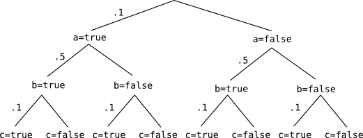

* table of contents
{:toc}

# Goal

There are a few different things that we might think the "best heuristic factor" might be. I'm comparing a bunch of things, with the hypothesis that expected factor or expected factor scaled by the variance will be the best.

* "expected score": expectation over the prior distribution of the overall score in the posterior (including the trace so far)
* "expected future score": expectation over the future of the prior distribution of the future score in the posterior (excluding the trace so far)
* "expected factor": expectation over the future of the prior distribution of the future overall factor (if this is an estimate, possibly weighted by the confidence in that estimate)
* "weighted expected factor": expectation over the future of the prior distribution of the future overall factor, weighted by the variance on that quantity (and if this is an estimate, possibly also weighted by the confidence in that estimate)

We also have manual heuristic factors that we've chosen for some programs that we can compare to these computed values.

I'm using a version of `funnybinomial` from [DIPPL Chapter 4](//dippl.org/chapters/04-factorseq.html) as a first example program. My goal is to fully understand how different numbers of particles and different heuristic factors affect (speed of) convergence. The change I make from the example online is changing $$P(b)$$ to 0.5. I do this because I am using particle filters: In order to get the particle filter to screw up in the default case, the *a posteriori* best solution should be *a priori* unlikely.

Here's the program.

~~~
var funnybinomial = function(){
  var a = sample(bernoulliERP, [0.1])
  var b = sample(bernoulliERP, [0.5])
  var c = sample(bernoulliERP, [0.1])
  factor( (a|b|c) ? 0:-10)
  return a + b + c;
}

print(Enumerate(funnybinomial, 20));
~~~

Here's a graph of the random choices in the program, not including the `factor( (a|b|c)?0:-10 )` at the end.

# Calculations

We can compute the values of these different possible heuristic factors.

## Expected score

* ...once we know `a`

$$ \begin{align*}
	\mathbb{E}(score \ | \ a=true)
		&= \sum_{b, c} P(b)P(c)(\ln(P(a=true)P(b)P(c)) + factor(a=true,b,c)) \\
		&= (.5)(.1)\ln((.1)(.5)(.1)) + (.5)(.9)\ln((.1)(.5)(.9)) + \\
		& \ \ \ \ \ (.5)(.1)\ln((.1)(.5)(.1)) + (.5)(.9)\ln((.1)(.5)(.9)) \\
	& \approx -3.3208 \\ \\
	\mathbb{E}(score \ | \ a=false)
		&= \sum_{b, c} P(b)P(c)(\ln(P(a=false)P(b)P(c)) + factor(a=false,b,c)) \\
		&= (.5)(.1)\ln((.9)(.5)(.1)) + (.5)(.9)\ln((.9)(.5)(.9)) + \\
		& \ \ \ \ \ (.5)(.1)\ln((.9)(.5)(.1)) + (.5)(.9)[ \ln((.9)(.5)(.9)) - 10 ] \\
	& \approx -5.6236
\end{align*} $$

* ...once we know both `a` and `b`

$$ \begin{align*}
	\mathbb{E}(score \ | \ a=true, b=true)
		&= \sum_{c} P(c)(\ln(P(a=true)P(b=true)P(c)) + factor(a=true,b=true,c)) \\
		&= (.1)\ln((.1)(.5)(.1)) + (.9)\ln((.1)(.5)(.9)) \\
	& \approx -3.3208 \\ \\
	\mathbb{E}(score \ | \ a=true, b=false)
		&= \sum_{c} P(c)(\ln(P(a=true)P(b=false)P(c)) + factor(a=true,b=false,c)) \\
		&= (.1)\ln((.1)(.5)(.1)) + (.9)\ln((.1)(.5)(.9)) \\
	& \approx -3.3208 \\ \\
	\mathbb{E}(score \ | \ a=false, b=true)
		&= \sum_{c} P(c)(\ln(P(a=false)P(b=true)P(c)) + factor(a=false,b=true,c)) \\
		&= (.1)\ln((.9)(.5)(.1)) + (.9)\ln((.9)(.5)(.9)) \\
	& \approx -1.1236 \\ \\
	\mathbb{E}(score \ | \ a=false, b=false)
		&= \sum_{c} P(c)(\ln(P(a=false)P(b=false)P(c)) + factor(a=false,b=false,c)) \\
		&= (.1)\ln((.9)(.5)(.1)) + (.9)[ \ln((.9)(.5)(.9)) - 10 ] \\
	& \approx -10.124
\end{align*} $$

This is by far the hardest value to compute. With this as a heuristic factor, we would also double-count the prior probability of every random choice in the program. We would weight one random choice based on the prior probabilities of all the future random choices, and then when we get to those random choices, sample according to those probabilities. This is almost certainly not what we want to be doing.

## Expected future score

* ...once we know `a`

$$ \begin{align*}
	\mathbb{E}(score \ | \ a=true)
		&= \sum_{b, c} P(b)P(c)[\ln(P(b)P(c)) + factor(a=true,b,c)] \\
		&= (.5)(.1)\ln((.5)(.1)) + (.5)(.9)\ln((.5)(.9)) + \\
		& \ \ \ \ \ (.5)(.1)\ln((.5)(.1)) + (.5)(.9)\ln((.5)(.9)) \\
	& \approx -1.0182 \\ \\
	\mathbb{E}(score \ | \ a=false)
		&= \sum_{b, c} P(b)P(c)[\ln(P(b)P(c)) + factor(a=false,b,c)] \\
		&= (.5)(.1)\ln((.5)(.1)) + (.5)(.9)\ln((.5)(.9)) + \\
		& \ \ \ \ \ (.5)(.1)\ln((.5)(.1)) + (.5)(.9)[ \ln((.5)(.9)) - 10 ] \\
	& \approx -5.5182
\end{align*} $$

* ...once we know both `a` and `b`

$$ \begin{align*}
	\mathbb{E}(score \ | \ a=true \ \mbox{OR} \ b=true)
		&= \sum_{c} P(c)[\ln(P(c)) + factor(\ (a=true \ \mbox{OR} \ b=true) \ \mbox{AND} \ c)] \\
		&= (.1)\ln(.1) + (.9)\ln(.9) \\
	& \approx -0.32508 \\ \\
	\mathbb{E}(score \ | \ a=false, b=false)
		&= \sum_{c} P(c)[\ln(P(c)) + factor(a=false,b=false,c)] \\
		&= (.1)\ln(.1) + (.9)[ \ln(.9) - 10 ] \\
	& \approx -9.3251
\end{align*} $$

This is somewhat easier to compute, but it still double-counts all of the prior probabilities of all of the future random choices.

## Expected factor

* ...once we know `a`

$$ \begin{align*}
	\mathbb{E}(factor \ | \ a=true)
		&= \sum_{b, c} P(b)P(c)factor(a=true,b,c) \\
		&= 0 \\ \\
	\mathbb{E}(factor \ | \ a=false)
		&= \sum_{b, c} P(b)P(c)factor(a=false,b,c) \\
		&= (.5)(.9)(- 10) \\
	& -4.5
\end{align*} $$

* ...once we know both `a` and `b`

$$ \begin{align*}
	\mathbb{E}(factor \ | \ a=true \ \mbox{OR} \ b=true)
		&= 0 \\ \\
	\mathbb{E}(factor \ | \ a=false \ \mbox{AND} \ b=false)
		&= \sum_{c} P(c)factor(a=false,b=false,c) \\
		&= 0 + .9(-10) \\
	&= -9
\end{align*} $$

This is way easier to compute and doesn't double-count anything.

## Variance of expected factor

* ...once we know `a`

$$ \begin{align*}
	var(factor \ | \ a=true)
		&= \sum_{b, c} P(b)P(c)factor(a=true,b,c) \\
		&= 0 \\ \\
	var(factor \ | \ a=false)
		&= \sum_{b, c} P(b)P(c) [ factor(a=false,b,c) - \mathbb{E}(factor \ | \ a=false) ]^2 \\
		&= (1- (.5)(-4.5))[0 - (-.9)]^2 + (.5)(.9)[-10 - (-4.5)]^2 \\
	&= 12.6
\end{align*} $$

* ...once we know both `a` and `b`

$$ \begin{align*}
	\mathbb{E}(factor \ | \ a=true \ \mbox{OR} \ b=true)
		&= 0 \\ \\
	\mathbb{E}(factor \ | \ a=false \ \mbox{AND} \ b=false)
		&= \sum_{c} P(c) [ factor(a=false,b=false,c) - \mathbb{E}(factor \ | \ a=false \ \mbox{AND} \ b=false) ]^2 \\
		&= (.1)[0 - (-9)]^2 + .9[-10 - (-9)]^2 \\
	&= 9
\end{align*} $$

We can then multiply the expected factor by the inverse of this variance to get a heuristic factor that is weaker for futures with higher variance in the value of the factor.

# Simulations

## Possible Heuristic Factors

First, we make a heuristic factor calculator for every type of heuristic factor. Each calculator function takes in the current state and returns the corresponding factor.

~~~
var expected_score = function(a, b) {
  if (b==null) {
    return a?-3.3208:-5.6236;
  } else {
    return a ? (b?-3.3208:-3.3208) : (b?-1.1236:-10.124);
  }
}

var expected_future_score = function(a, b) {
  if (b==null) {
    return a?-1.0182:-5.5182;
  } else {
    return (a|b) ? -0.32508 : -9.3251 ;
  }
}

var expected_factor = function(a, b) {
  return (b == null) ? (a?0:-4.5) : ((a|b)?0:-9);
}

var scale = function(mu, variance) {
  return mu / variance;
}

var weighted_expected_factor = function(a, b) {
  var mu = expected_factor(a,b);
  var variance = (b == null) ? 12.6 : 9;
  return scale(mu, variance);
}

var manual_heuristic_factor = function(a, b) {
  return (b==null)? (a?0:-1) : ((a|b)?0:-1);
}
///fold:
print( "expected score" );
print( "T_: " + expected_score(true) );
print( "F_: " + expected_score(false) );
print( "TT: " + expected_score(true, true) );
print( "TF: " + expected_score(true, false) );
print( "FT: " + expected_score(false, true) );
print( "FF: " + expected_score(false, false) );

print( "expected future score" );
print( "T_: " + expected_future_score(true) );
print( "F_: " + expected_future_score(false) );
print( "TT: " + expected_future_score(true, true) );
print( "TF: " + expected_future_score(true, false) );
print( "FT: " + expected_future_score(false, true) );
print( "FF: " + expected_future_score(false, false) );

print( "expected factor" );
print( "T_: " + expected_factor(true) );
print( "F_: " + expected_factor(false) );
print( "TT: " + expected_factor(true, true) );
print( "TF: " + expected_factor(true, false) );
print( "FT: " + expected_factor(false, true) );
print( "FF: " + expected_factor(false, false) );

print( "weighted expected factor" );
print( "T_: " + weighted_expected_factor(true) );
print( "F_: " + weighted_expected_factor(false) );
print( "TT: " + weighted_expected_factor(true, true) );
print( "TF: " + weighted_expected_factor(true, false) );
print( "FT: " + weighted_expected_factor(false, true) );
print( "FF: " + weighted_expected_factor(false, false) );

print( "manual heuristic factor" );
print( "T_: " + manual_heuristic_factor(true) );
print( "F_: " + manual_heuristic_factor(false) );
print( "TT: " + manual_heuristic_factor(true, true) );
print( "TF: " + manual_heuristic_factor(true, false) );
print( "FT: " + manual_heuristic_factor(false, true) );
print( "FF: " + manual_heuristic_factor(false, false) );
///
~~~

Notice that for all but the "expected score" function, the lowest heuristic factors are for when `a` is false and when `(a|b)` is false.

## Target function

We use as a target function the total variation distance: the sum of differences between the probabilities under the target and sampled distributions for every element in the support of the target function.

~~~
///fold:
var expected_score = function(a, b) {
  if (b==null) {
    return a?-3.3208:-5.6236;
  } else {
    return a ? (b?-3.3208:-3.3208) : (b?-1.1236:-10.124);
  }
}

var expected_future_score = function(a, b) {
  if (b==null) {
    return a?-1.0182:-5.5182;
  } else {
    return (a|b) ? -0.32508 : -9.3251 ;
  }
}

var expected_factor = function(a, b) {
  return (b == null) ? (a?0:-4.5) : ((a|b)?0:-9);
}

var scale = function(mu, variance) {
  return mu / variance;
}

var weighted_expected_factor = function(a, b) {
  var mu = expected_factor(a,b);
  var variance = (b == null) ? 12.6 : 9;
  return scale(mu, variance);
}

var manual_heuristic_factor = function(a, b) {
  return (b==null)? (a?0:-1) : ((a|b)?0:-1);
}

var none = function(a,b) {
  return 0;
}
///
var funnybinomial = function(hf) {
  return function(){
    var a = sample(bernoulliERP, [0.1])
    factor(hf(a));
    var b = sample(bernoulliERP, [0.5])
    factor( hf(a,b) - hf(a) );
    var c = sample(bernoulliERP, [0.1])
    factor( ((a|b|c) ? 0:-10) - hf(a,b));
    return a + b + c;
  }
}

var trueERP = Enumerate(funnybinomial(none), 20);

var total_variation_distance = function(ERP) {
  var sample_support = ERP.support();
  var true_support = trueERP.support();
  var true_probs = map(function(x) {
    return Math.exp(trueERP.score([], x));
  }, sample_support);
  var sample_probs = map(function(x) {
    return Math.exp(ERP.score([], x));
  }, sample_support);
  return 0.5 * sum(map2(function(true_prob, sample_prob) {
    return Math.abs(sample_prob - true_prob);
  }, true_probs, sample_probs));
}

var sampleERP = ParticleFilter(funnybinomial(none), 3);
print(sampleERP);

var true_support = trueERP.support();

var true_probs = map(function(x) {
  return Math.exp(trueERP.score([], x));
}, true_support);
print(true_probs);

var sample_probs = map(function(x) {
  return Math.exp(sampleERP.score([], x));
}, true_support);
print(sample_probs);

var total_variation_distance = 0.5 * sum(map2(function(true_prob, sample_prob) {
  return Math.abs(sample_prob - true_prob);
}, true_probs, sample_probs));
print(total_variation_distance);
~~~

## Results

We can run a particle filter a bunch of times, with different numbers of particles and calculate the value of the target function on each run of the particle filter. We can do this for different heuristic factors.

~~~
///fold:
var expected_score = function(a, b) {
  if (b==null) {
    return a?-3.3208:-5.6236;
  } else {
    return a ? (b?-3.3208:-3.3208) : (b?-1.1236:-10.124);
  }
}

var expected_future_score = function(a, b) {
  if (b==null) {
    return a?-1.0182:-5.5182;
  } else {
    return (a|b) ? -0.32508 : -9.3251 ;
  }
}

var expected_factor = function(a, b) {
  return (b == null) ? (a?0:-4.5) : ((a|b)?0:-9);
}

var scale = function(mu, variance) {
  return mu / variance;
}

var weighted_expected_factor = function(a, b) {
  var mu = expected_factor(a,b);
  var variance = (b == null) ? 12.6 : 9;
  return scale(mu, variance);
}

var manual_heuristic_factor = function(a, b) {
  return (b==null)? (a?0:-1) : ((a|b)?0:-1);
}

var none = function(a,b) {
  return 0;
}

var funnybinomial = function(hf) {
  return function(){
    var a = sample(bernoulliERP, [0.1])
    factor(hf(a));
    var b = sample(bernoulliERP, [0.5])
    factor( hf(a,b) - hf(a) );
    var c = sample(bernoulliERP, [0.1])
    factor( ((a|b|c) ? 0:-10) - hf(a,b));
    return a + b + c;
  }
}

var trueERP = Enumerate(funnybinomial(none), 20);

var total_variation_distance = function(ERP) {
  var sample_support = ERP.support();
  var true_support = trueERP.support();
  var true_probs = map(function(x) {
    return Math.exp(trueERP.score([], x));
  }, sample_support);
  var sample_probs = map(function(x) {
    return Math.exp(ERP.score([], x));
  }, sample_support);
  return 0.5 * sum(map2(function(true_prob, sample_prob) {
    return Math.abs(sample_prob - true_prob);
  }, true_probs, sample_probs));
}
///
var n_samples = 100;

var particles = function(hf, target_fn, n_particles) {
  return function() {
    var sampleERP = ParticleFilter(funnybinomial(hf), n_particles);
    return target_fn(sampleERP);
  }
}

var run = function(hf, target_fn, n_particles) {
  return Math.abs(expectation(ParticleFilter(particles(hf, target_fn, n_particles), n_samples)));
}

var numbers_of_particles = [3, 5, 10
];
var target_functions = [total_variation_distance //mean, variance, prob(1), prob(2), prob(3)
];
var hfs = [none, expected_score, expected_future_score, manual_heuristic_factor, expected_factor, weighted_expected_factor
];

map(function(hf) {
  map(function(target_fn) {
    map(function(n_particles) {
      print(run(hf, target_fn, n_particles));
      return 1;
    }, numbers_of_particles);
    return 1;
  }, target_functions);
  return 1;
}, hfs)
~~~

The results 